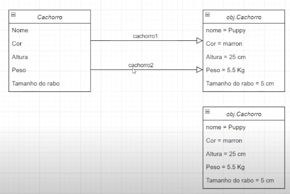

Comments
One line - //
A paragraph - /**/

Var name creation rules
Can contain only: letters, $_$, $, 0-10;
Cannot start with numbers
It's good practice to start with a lowercase letter
Cannot have spaces within
Cannot use a reserved word of Java (data formats, int, catch, etc) //if you use them, it doesn't compile.
It needs to be unique inside the scope

Default formats
int, long, byte // 0
double, float // 0.0f
boolean //false
char //' '
String //null //default of any object is null

Casting
float a = 5.0f
double b = 2.0d

float x = a+b returns error because they are different types. To fix this
float x = a+ (float) b this is telling Java that it can turn b into a float. Java cannot change it automatically so you change it manually.
//it changes the space the var occupies in the memory. Usually, when a bigger type has to become a smaller type, it needs casting.

Java lets developers insert _ in numbers so you can read more clearly
int a = 23450219 == int a = 23_450_219 (you can put anywhere, but it may not make sense)

Garbage collector

The garbage collector is going to clean the object without a reference var.

... is var args. Creates a method without setting how many arguments this method is going to have.

Inheritance x Coupling

